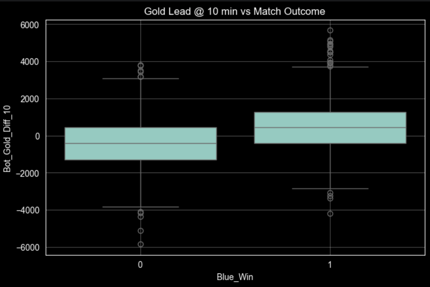
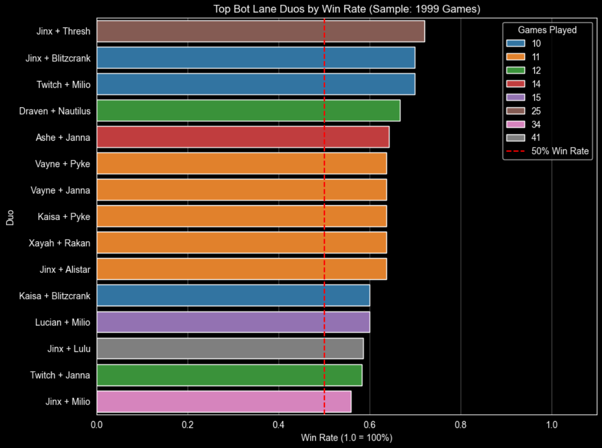
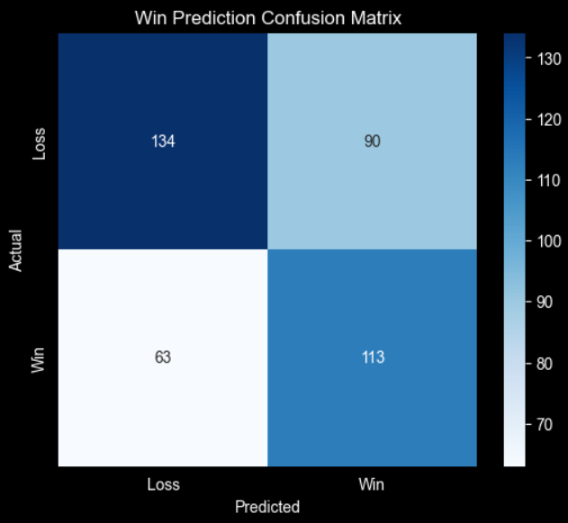
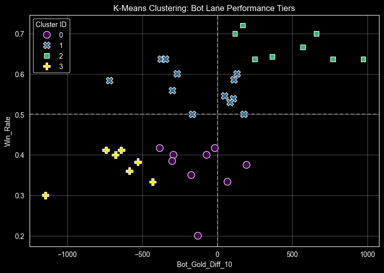

## Bot Lane Dynamics: Analyzing Synergy & Win Conditions in League of Legends
* **DSA210 Project**
* **Student Name: Nazim Mammadov**
* **Student ID: 33525**
## Project Overview
This project investigates the relationship between champion draft synergies, early player performance, and match outcomes in the 2v2 bottom lane in League of Legends. By analyzing historical data from high-ranked matches, this project identifies whether early laning leads (Gold Difference @ 10 min) predict the final game winner and evaluates champion synergy using Machine Learning.

## Research Questions
To address the project goals, this analysis focuses on the following key questions:
* **RQ 1:** To what extent does an early economic lead (Gold Difference at 10 minutes) correlate with the final match victory?
* **RQ 2:** Which specific ADC + Support combinations demonstrate the highest win rates in the current meta?
* **RQ 3:** Can a Machine Learning model (Random Forest) accurately predict the match winner based solely on the four champions selected in the bot lane?
* **RQ 4:** Can we automatically classify bot lane duos into performance tiers (e.g., 'OP' vs. 'Weak') without human bias?

---

## Motivation
Picking the right champion in League of Legends is a critical component of the game. Many players believe the match is often won or lost based on the draft phase alone. For bottom lane players—specifically the ADC (main damager) and Support—the pressure to select a synergistic pair is high. Currently, most players rely on intuition or anecdotal evidence. This project uses data from thousands of real games to replace guesswork with statistical evidence.

---

## Data Sources
I utilized a hybrid data collection strategy to build a comprehensive dataset:
1.  **Kaggle Dataset (Seed Data):** Used as a baseline to obtain valid Match IDs and final game outcomes (Win/Loss) for high-ELO matches.
2.  **Riot Games API (Enrichment):**
    * **Match-V5 Endpoint:** Extracted the specific champions played in the ADC and Support roles.
    * **Timeline-V5 Endpoint:** Calculated the granular "Gold Difference at 10 Minutes" metric for every match.

---
## How to Run

1.  **Clone the repository**
    ```bash
    git clone [https://github.com/wasbinko/dsa210-project-lol.git](https://github.com/wasbinko/dsa210-project-lol.git)
    cd dsa210-project-lol
    ```

2.  **Install Dependencies**
    Ensure you have Python installed, then run:
    ```bash
    pip install -r requirements.txt
    ```

3.  **Run the Analysis**
    * To view the full analysis, code, and visualizations, open the Jupyter Notebook:
        ```bash
        jupyter notebook forgit.ipynb
        ```
    * *Note: The raw data is located in the `data/` folder. If you wish to fetch fresh data, you will need a valid Riot Games API key.*

## Methodology

### 1. Data Collection & Processing
* **Tools:** Python, Pandas, `riotwatcher` (for API rate limiting), `tqdm` (progress tracking).
* **Pipeline:**
    * Iterated through match IDs from the seed dataset.
    * Filtered out invalid matches (e.g., remakes, non-standard lanes).
    * Calculated the **Gold Differential** (Blue Bot Gold - Red Bot Gold) at frame 10 (10:00).
    * Aggregated data into a structured CSV (`bot_lane_dataset.csv`) containing Champion names, Gold Stats, and Win Results.

### 2. Analysis & Modeling 
* **Statistical Testing:** Performed a **Student's T-Test** to verify the significance of the relationship between early gold leads and victory.
* **Visualization:** Created Boxplots (with jitter) to visualize gold distributions and Ranked Bar Charts to display Duo Win Rates.

### 3. Machine Learning Models
* **Win Prediction (Random Forest):**
   * **Features:** Champion IDs and early game gold difference.
       * **Evaluation:** Analyzed accuracy and the confusion matrix to understand prediction errors.
* **Duo Clustering (K-Means):**
   *  **Model:** K-Means Clustering with **k=4**.
       * **Features:** Win Rate and Average Gold Difference @ 10.
       * **Goal:** Group bot lane pairs into performance tiers.
---

## Key Findings

### The Impact of Early Gold
* **Result:** There is an overwhelming correlation between early gold leads and victory.
* **Evidence:** The T-Test yielded a **P-Value of ~1.34e-51**, confirming the results are extremely statistically significant ($p < 0.05$).
* **Visualization:** Shows that winning teams have a significantly higher median gold lead at 10 minutes.


### Strongest & Weakest Duos
### Top 5 Strongest Duos
| Blue Duo | Win Rate | Games Played | Bot Gold Diff @ 10 |
| :--- | :---: | :---: | :---: |
| **Jinx + Thresh** | 72.0% | 25 | 166.76 |
| **Jinx + Blitzcrank** | 70.0% | 10 | 116.60 |
| **Twitch + Milio** | 70.0% | 10 | 657.70 |
| **Draven + Nautilus** | 66.7% | 12 | 567.92 |
| **Ashe + Janna** | 64.3% | 14 | 365.00 |

### Bottom 5 Weakest Duos
| Blue Duo | Win Rate | Games Played | Bot Gold Diff @ 10 |
| :--- | :---: | :---: | :---: |
| **Kaisa + Braum** | 20.0% | 10 | -130.00 |
| **Kaisa + Alistar** | 30.0% | 10 | -1145.90 |
| **Samira + Nautilus** | 33.3% | 12 | -431.25 |
| **Zeri + Milio** | 33.3% | 12 | 66.92 |
| **Zeri + Lulu** | 35.0% | 20 | -173.95 |

* **Top Performers:** **Jinx + Thresh** (~72% Win Rate) and **Twitch + Milio** (~70% Win Rate) represent high-synergy pairings.
* **Underperformers:** **Kaisa + Braum** (~20% Win Rate) and **Kaisa + Alistar** (~30% Win Rate) show significantly lower synergy in the current dataset.
* **Visualization:** (Mostly shows the top and mid tier duos, with the lower tiers not seen due to the sheer amount of them and inability to show that all in a graph)

 

### Predicting Wins (Machine Learning)
* **Model Accuracy:** The Random Forest model achieved an accuracy of **61.75%**.
* **Confusion Matrix Analysis:** * The model correctly identified 61.75% of outcomes. 
    * It is particularly accurate at identifying losses when the bot lane falls behind (True Positive). 
    * **False Positives:** The main error type occurred when the model predicted a win due to a bot lane lead, but the team still lost. This highlights that while bot lane is influential, mid/late-game "throws" or other lanes feeding can still override a bot lane advantage.
* **Visualization:**
  
  

### Automated Tier List (Clustering)
Using **K-Means Clustering (k=4)**, the algorithm automatically categorized bot lane duos into tiers:
* **S-Tier (Dominant) (Cluster ID: 2):** Win Rates **> 60%** and consistent positive gold leads. These are the dominant meta picks. They consistently win the laning phase by a significant margin (nearly +500 gold lead early) and convert that advantage into game wins. These duos are high-priority "Pick or Ban" candidates.
* **A-Tier (Strong):** Win Rates between **52% and 58%**. The "Reliable" tier. Interestingly, these duos tend to go slightly negative or even in the laning phase, yet they maintain a high win rate. This suggests these combinations rely on **mid-to-late game scaling** or teamfight utility rather than early lane dominance. They are safe, resilient choices that recover well..
* **C-Tier (Meh):** Win Rates hovering around **33-41%**. These duos are "Empty Stats." Their laning phase looks statistically similar to Tier A (only a small gold deficit), but they fail to convert into wins, resulting in the lowest win rate of all clusters. These picks survive the lane but likely lack the scaling(bad levelling up percentage) or team synergy to impact the outcome of the match.
* **F-Tier (Very bad):** Win Rates **< 41%** The "Disaster" tier. These duos suffer massive deficits during the laning phase, falling nearly 700 gold behind on average. While their win rate is technically slightly higher than Tier C, the sheer volatility of their laning phase makes them extremely risky and generally unviable.
### Cluster Averages

| Cluster | Win Rate | Bot Gold Diff @ 10 |
| :---: | :---: | :---: |
| **2** (S) | 66.7% | 482.78 |
| **1** (A) | 56.8% | -125.98 |
| **0** (C) | 36.4% | -123.33 |
| **3** (F) | 37.1% | -679.34 |

**Visualization:** We can confirm that the S-Tier cluster(Cluster ID:2), has the biggest positive gold difference and subsequently the highest win rate, and in contrast F-tier (Cluster ID: 3) have the biggest negative gold difference, and almost the lowest win rate.



## Limitations & Future Work

While this analysis provides significant insights into bot lane dynamics, several limitations should be noted:

* **Patch Unpredictability:** League of Legends updates every two weeks. This dataset reflects a specific patch cycle, and champion strengths (win rates) may vary significantly in future patches due to buffs or nerfs.
* **Rank Disparity:** The analysis focuses on "High-ELO" matches to ensure data quality. Consequently, the "S-Tier" picks identified here may not perform as effectively in lower ranks (Iron-Gold) where mechanical skill varies.
* **Sample Size for Off-Meta Picks:** Rare duos (like Kaisa + Alistar) have smaller sample sizes, making their win rate data less statistically robust than popular pairings like Jinx + Thresh.

**Future Work:**
To expand on this project, future iterations could include:
* **Jungle Influence:** Integrating data on Jungle ganks to see how external pressure influences the 2v2 lane outcome.
* **Match Duration Analysis:** Filtering specifically for long vs. short games to see which duos fall off hardest after 30 minutes.

## AI Usage Declaration

In accordance with the academic integrity policy, I disclose the use of AI tools in this project:

* **Tool Used:** Google Gemini
* **Purpose:**
    * Formatting text into clean Markdown format for this report.
    * Refining the structure and clarity of the README file.
* **Verification:** All code logic, data collection, and analytical conclusions were implemented and verified manually by the author(me).
